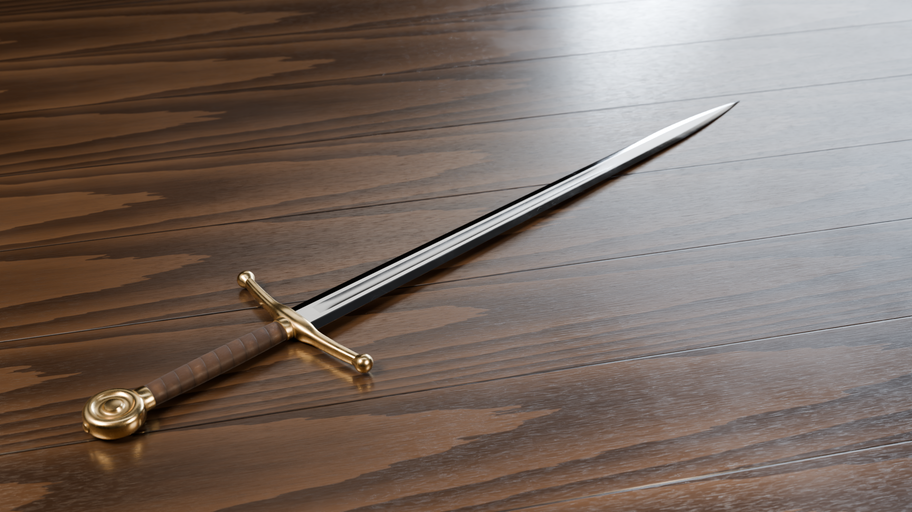
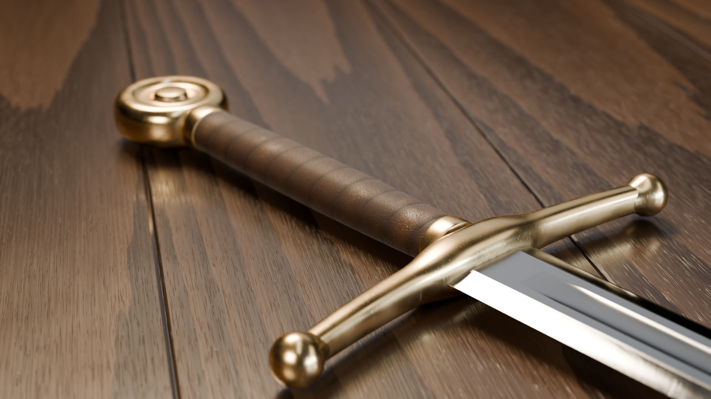

# Photorealistic Sword (Blender / Cycles)

A fully procedural European arming sword. `make_sword.py` builds the geometry, materials, lighting and cameras, with no external textures or downloads.




## What's in it

**Geometry** (real-world scale, metres)
- **Blade:** lofted from 220 cross-sections. It has a distal taper, an ogive point, slightly convex edge bevels, a very small flat along the edge and a rounded fuller that fades in and out.
- **Crossguard:** a curved bar with a rounded-rectangle cross-section, a thicker block in the middle and turned knob ends.
- **Grip:** a slightly barrel-shaped oval, capped at both ends by brass ferrules.
- **Pommel:** a turned wheel pommel with a raised boss, a recessed ring and a rim, plus the peened end of the tang.

**Materials** (Principled BSDF, all procedural)
- **Blade steel:** anisotropic brushing that runs along the blade. The polish is different on the flats, the edge bevels and the fuller. There are angled grinding lines on the bevels, patches of fine scratches and handling smudges.
- **Aged brass:** darker patina in the crevices (driven by ambient occlusion), tarnish, grime and fine scratches.
- **Wrapped leather:** a real spiral wrap made from object-space angle and height, with cracked grain, pores and worn, shinier high points.
- **Walnut table:** a separate ring pattern for each plank, stretched fibres and pores, dark seams between planks, and a worn varnish coat.

**Lighting**
- Gradient "softbox" panels are placed at the mirror angle of the blade's flat face for each camera. That gives the steel a long, smooth reflection the way a product photographer would. The panels only appear in reflections.
- A warm key light, a cool rim light from behind, a small warm kicker on the hilt, a weak overhead fill and a dim studio-gradient world.
- Rendered in Cycles with 12 bounces (8 glossy), OpenImageDenoise, AgX colour with Medium High Contrast, and physical depth of field (7-blade aperture).

## Usage

With Blender 4.2+ installed:

```bash
blender -b -P make_sword.py -- --render
```

Or with the `bpy` Python module (`pip install bpy==4.5.4`, needs Python 3.11):

```bash
python make_sword.py --render
```

This writes `sword.blend` and `renders/sword_hero.png` + `renders/sword_closeup.png`.

| Option | Default | |
|---|---|---|
| `--samples N` | 256 | Cycles samples per pixel |
| `--res W H` | 1920 1080 | Output resolution |
| `--shots hero,closeup` | both | Which cameras to render |
| `--hdri file.hdr` | – | Use your own HDRI instead of the studio world |
| `--gpu` | off | Render on CUDA / OptiX / HIP / Metal if available |
| `--out DIR` | `renders/` | Where to write the images |

## Web viewer

`web/index.html` is an interactive three.js viewer: orbit, zoom, and buttons that jump to the hilt, pommel or point. It loads `web/sword.json` (glTF with the textures in `web/textures/`). `web/sword.glb` is the same model as a single file for other viewers and game engines.

To rebuild them, bake the procedural materials to textures and export:

```bash
python export_web.py          # or: blender -b -P export_web.py --
```

Serve the folder over HTTP to try it locally (`python -m http.server` in `web/`), since browsers block loading the model from `file://`.

## Opening in Blender

Open `sword.blend` to look around. `Cam_Hero` and `Cam_Closeup` are the two cameras, and all the materials can be edited in the Shader Editor.
